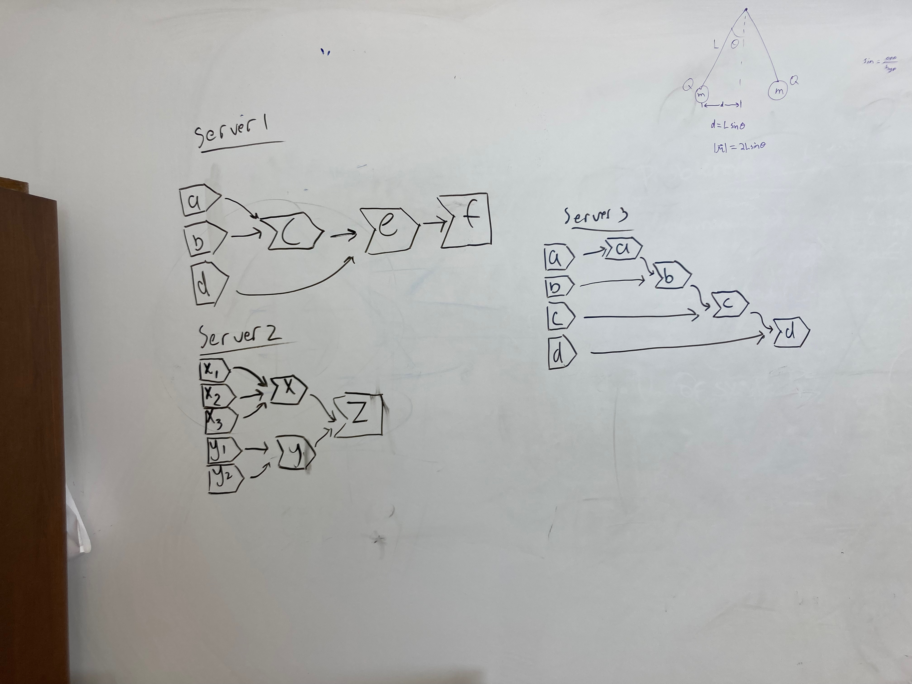

```{r setup, include=FALSE}
knitr::opts_chunk$set(echo = TRUE, warning = FALSE, message = FALSE)
```

# Exercise 1

Given this UI;

```{r}
library(shiny)
ui <- fluidPage(
  textInput("name", "What's your name?"),
  textOutput("greeting")
)
```

Fix the simple errors found in each of the three server functions below. First try spotting the problem just by reading the code; then run the code to make sure you’ve fixed it.

```{r}
server1 <- function(input, output, server) {
  input$greeting <- renderText(paste0("Hello ", name))
}

server1fixed <- function(input, output, server) {
  output$greeting <- renderText({paste0("Hello ", input$name)})
}

server2 <- function(input, output, server) {
  greeting <- paste0("Hello ", input$name)
  output$greeting <- renderText(greeting)
}

server2fixed <- function(input, output, server) {
  greeting <- reactive({ paste0("Hello ", input$name)})
  output$greeting <- renderText(greeting())
}

server3 <- function(input, output, server) {
  output$greting <- paste0("Hello", input$name)
}

server3fixed <- function(input, output, server) {
  output$greeting <- reactive({ paste0("Hello ", input$name) })
}
```

```{r}
shinyApp(ui, server1)
shinyApp(ui, server1fixed)
```

```{r}
shinyApp(ui, server2)
shinyApp(ui, server2fixed)
```

```{r}
shinyApp(ui, server3)
shinyApp(ui, server3fixed)
```


# Exercise 2

Draw the reactive graph for the following server functions
```{r}
server1 <- function(input, output, session) {
  c <- reactive(input$a + input$b)
  e <- reactive(c() + input$d)
  output$f <- renderText(e())
}
server2 <- function(input, output, session) {
  x <- reactive(input$x1 + input$x2 + input$x3)
  y <- reactive(input$y1 + input$y2)
  output$z <- renderText(x() / y())
}
server3 <- function(input, output, session) {
  d <- reactive(c() ^ input$d)
  a <- reactive(input$a * 10)
  c <- reactive(b() / input$c) 
  b <- reactive(a() + input$b)
}
```

